# MORA

<p align="center">
  <strong>Photo sharing, discovery, and organization — built for a seamless mobile experience.</strong>
</p>

<p align="center">
  <a href="#features">Features</a>
  &nbsp;·&nbsp;
  <a href="#screenshots">Screenshots</a>
  &nbsp;·&nbsp;
  <a href="#technology">Technology</a>
  &nbsp;·&nbsp;
  <a href="#getting-started">Getting Started</a>
</p>

---

## About

**MORA** is a photo-sharing and album management application developed for the **Advanced Programming** course.

Built with **Flutter** and **Java**, MORA combines photo management, album organization, search and discovery, social interactions, account customization, and administrative controls in a single mobile application.

The client and server communicate through a custom **TCP Socket** layer using **JSON** for data exchange.

---

## Features

### Authentication & Profiles

* User registration and login
* Profile and account management
* Username and password editing
* Profile picture selection from camera or gallery
* Account logout and deletion

### Photo Management

* Upload photos from gallery or camera
* Add titles, captions, and tags
* Assign photos to albums
* Edit published photos
* Enable or disable comments
* Like and comment on photos
* Share photos
* Save photos to the device gallery

### Explore & Discovery

* Browse photos, albums, and users
* Search by photo name or tag
* Sort available content
* Explore user profiles and public albums

### Albums

* Create custom albums
* Add and remove photos
* Organize photos across multiple collections
* Browse album contents

### Personalization

* Light and dark modes
* Multiple color themes
* Account and application settings

### Administration

* Admin dashboard
* User management
* User statistics
* Ban and unban controls

---

## Screenshots

### Authentication

<p align="center">
  
  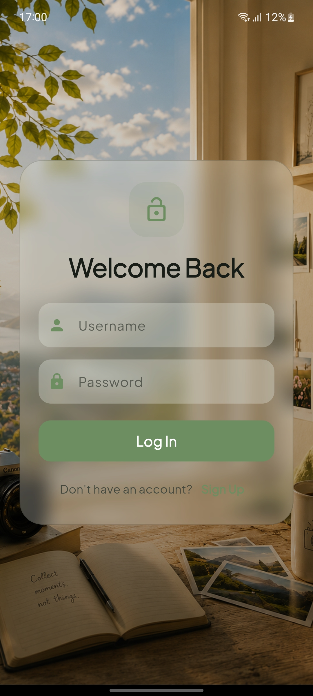
  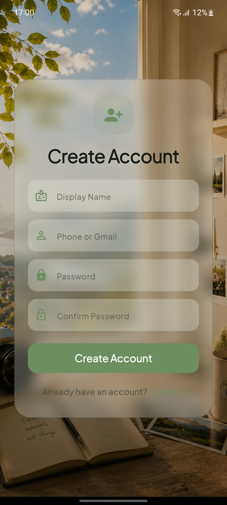
</p>

### Profile & Account Management

<p align="center">
  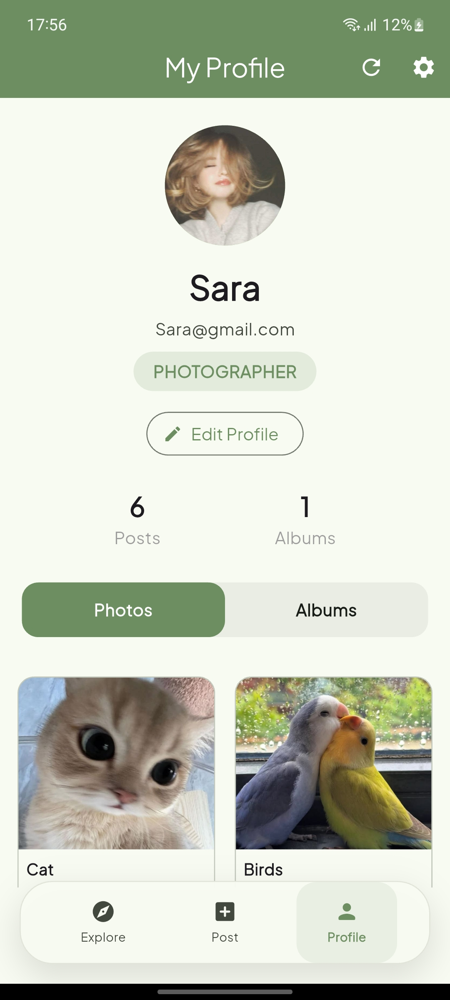
  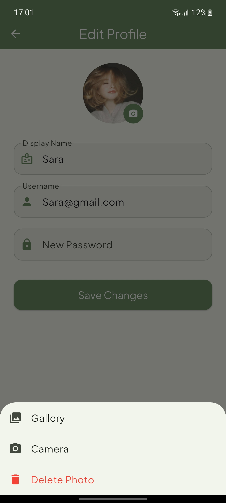
</p>

### Photo Details & Interaction

<p align="center">
  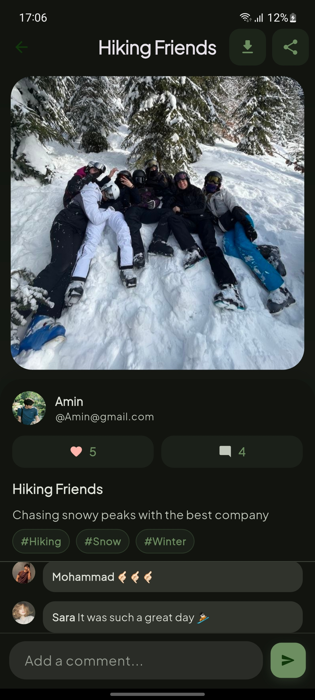
  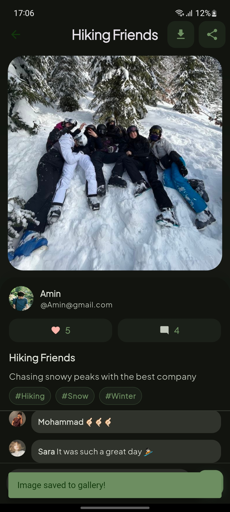
  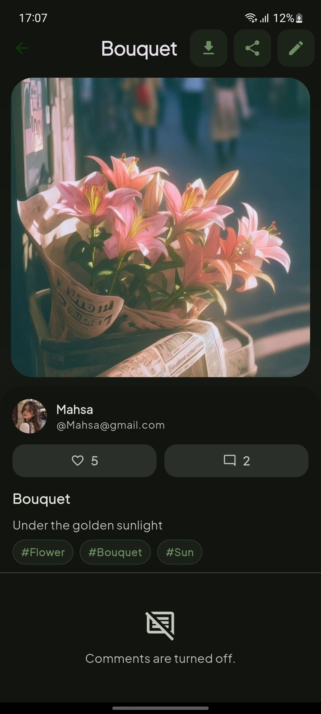
</p>

### Photo Publishing & Editing

<p align="center">
  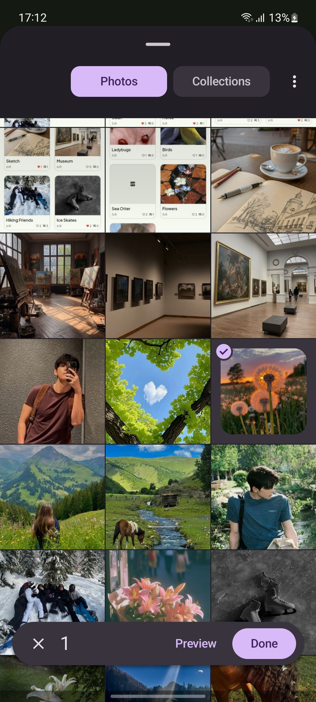
  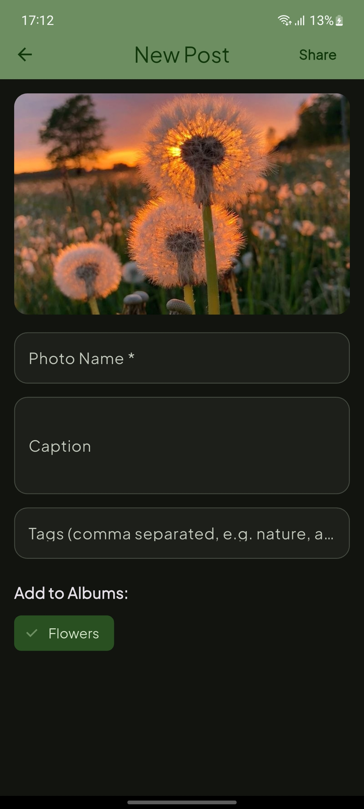
  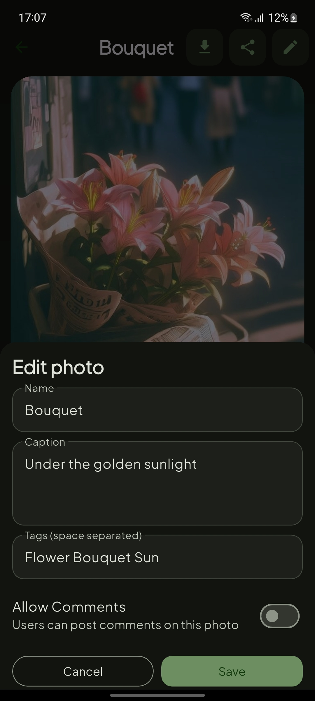
</p>

### Explore & Discovery

<p align="center">
  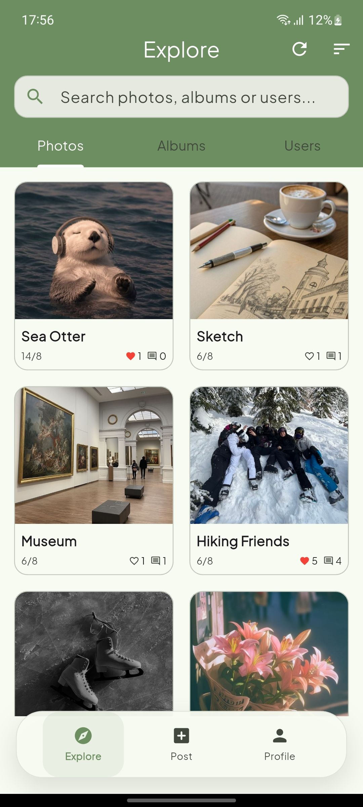
  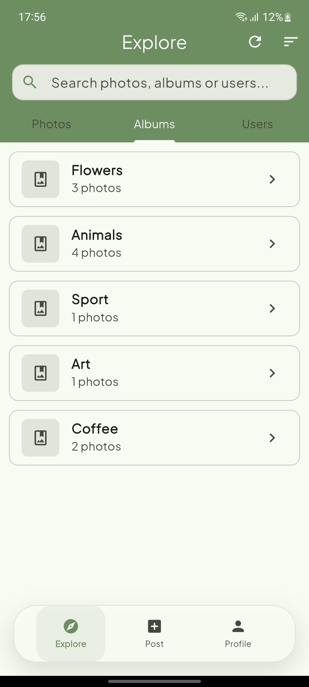
  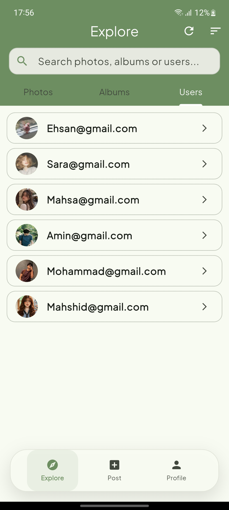
</p>

<p align="center">
  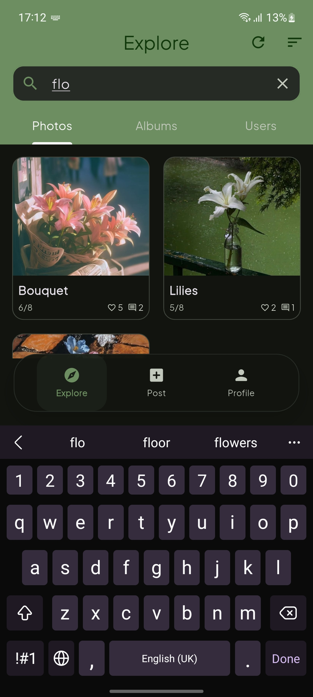
  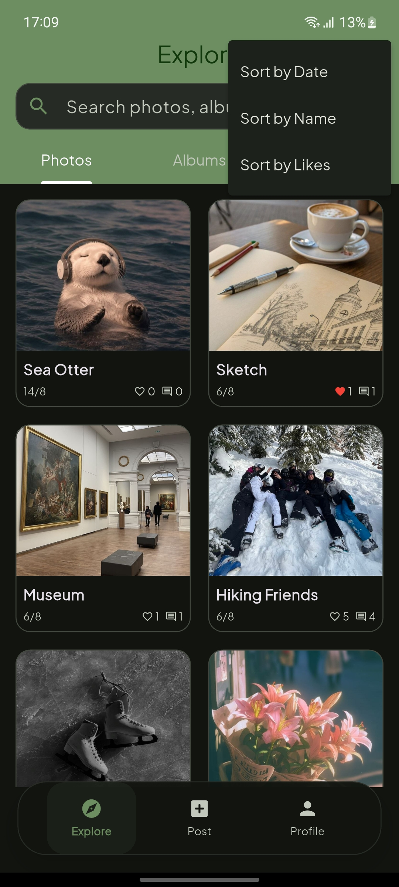
</p>

### Albums

<p align="center">
  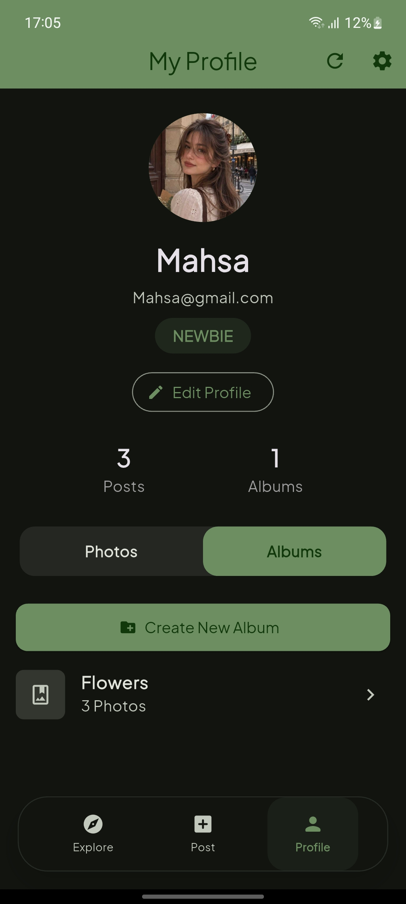
</p>

### Personalization & Settings

<p align="center">
  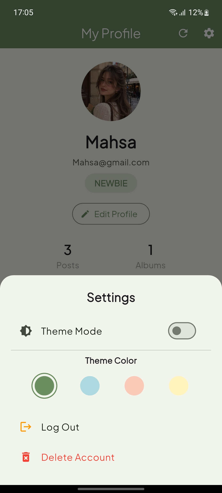
  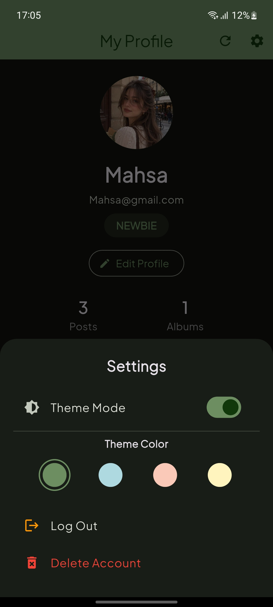
  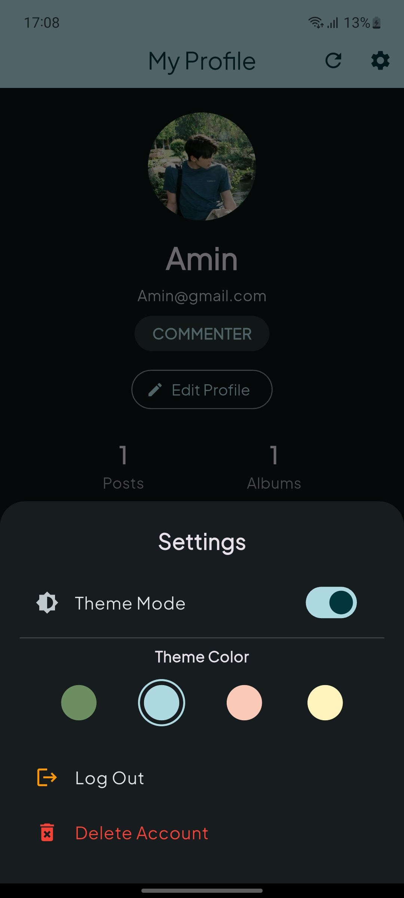
</p>

### Administration

<p align="center">
  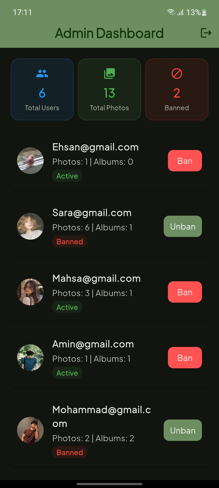
</p>

---

## Technology

| Layer              | Technology |
| ------------------ | ---------- |
| Mobile Application | Flutter    |
| Frontend           | Dart       |
| Backend            | Java 17    |
| Communication      | TCP Socket |
| Data Exchange      | JSON       |
| JSON Processing    | Gson       |

---

## Client–Server Communication

MORA uses a custom TCP Socket communication layer between the Flutter client and Java backend.

Requests and responses are exchanged as JSON messages, allowing the application to handle authentication, photo management, albums, user operations, and other interactions through a unified communication channel.

The backend supports concurrent client connections and processes requests independently.

```text
Flutter Application
        |
        | JSON over TCP
        v
   Java Backend
        |
   +----+----+
   |         |
   v         v
Data Logic  File Management
```

---

## Requirements

* Flutter SDK
* Dart SDK
* Java Development Kit 17+
* Android Studio or Visual Studio Code
* Android Emulator or physical Android device

---

## Getting Started

### 1. Clone the repository

```bash
git clone <repository-url>
cd MORA
```

### 2. Start the backend

Run the Java backend and make sure the server is active before launching the mobile application.

### 3. Configure the connection

Set the backend machine's local IP address in the Flutter socket configuration.

For physical devices and emulators, ensure that the client can reach the machine running the backend.

### 4. Install dependencies

```bash
flutter pub get
```

### 5. Run the application

```bash
flutter run
```

---

## Academic Context

MORA was developed as part of the **Advanced Programming** course, with a focus on applying software engineering and object-oriented programming concepts to a complete client-server application.

The project covers:

* Object-oriented programming
* Client-server architecture
* TCP socket communication
* JSON-based data exchange
* CRUD operations
* Persistent data management
* File handling
* Concurrent server processing
* Mobile application development with Flutter

---

## Credits

**Course:** Advanced Programming
**Instructor:** Dr. Sadegh Aliakbari

**Built with Flutter, Dart, Java, TCP Sockets, and JSON.**
