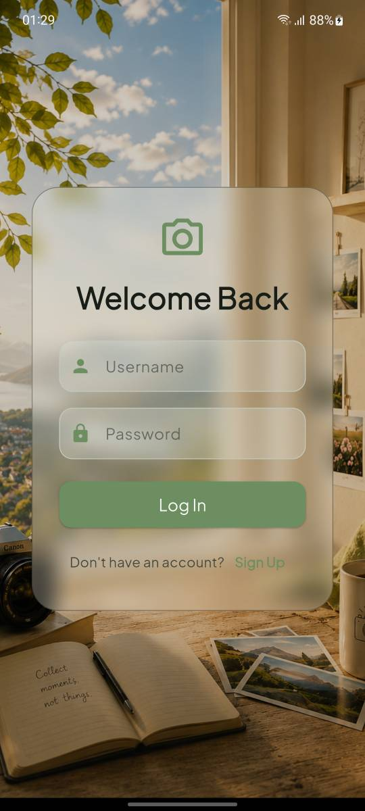
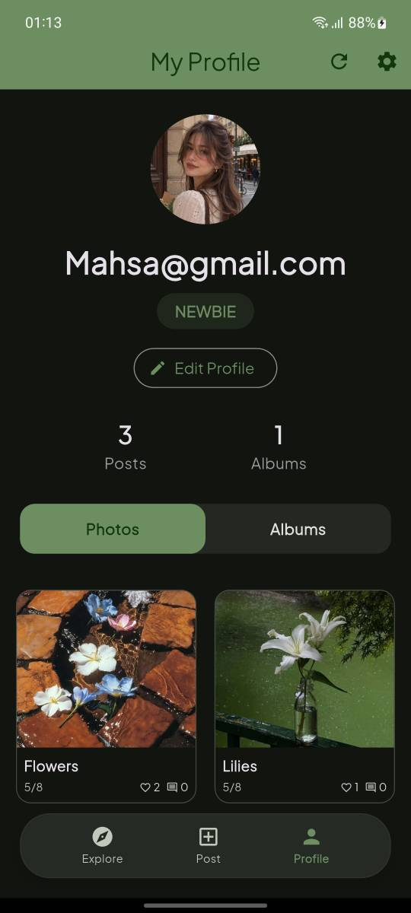
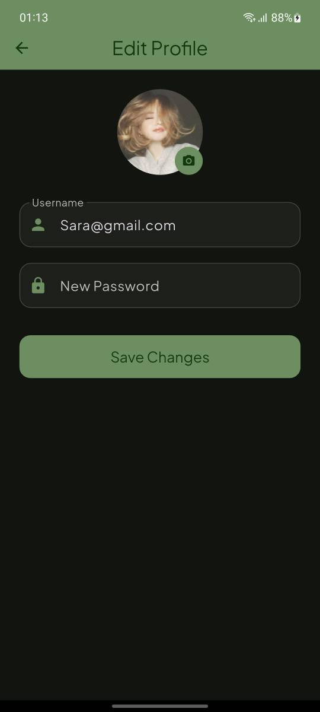
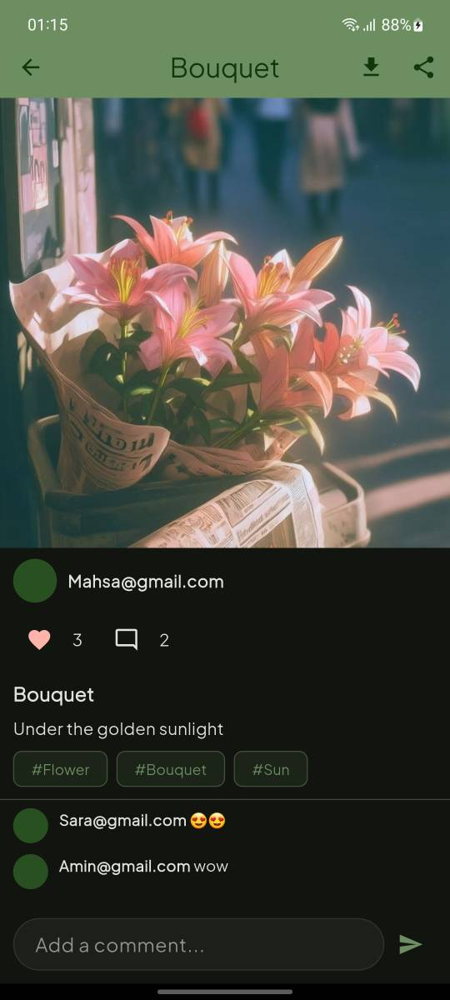
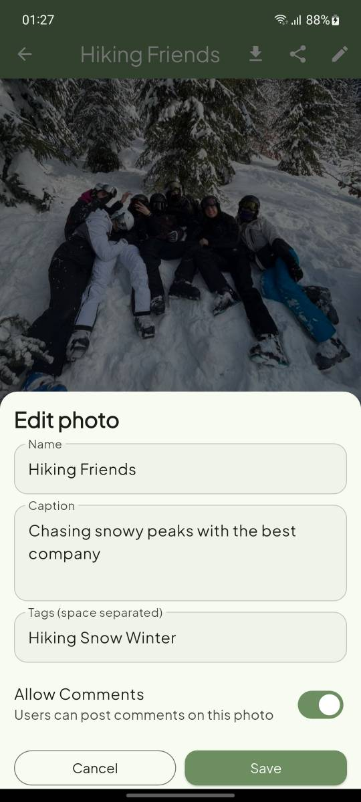
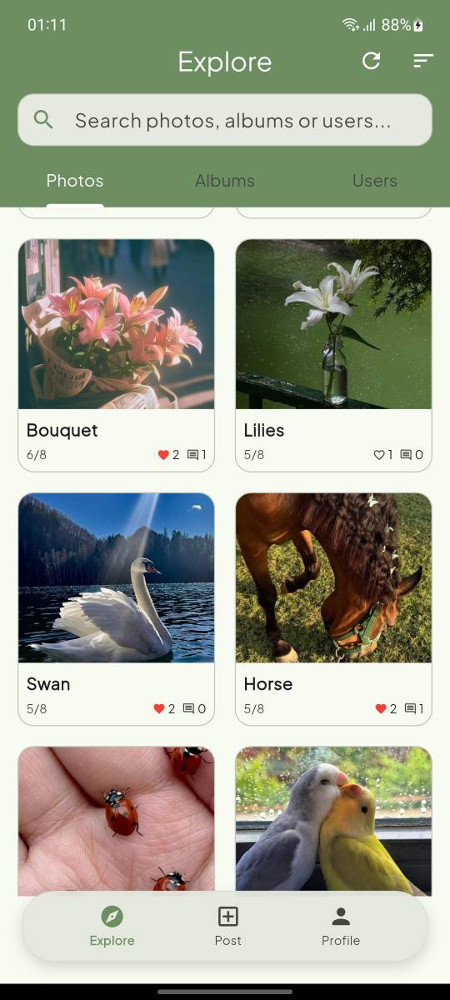
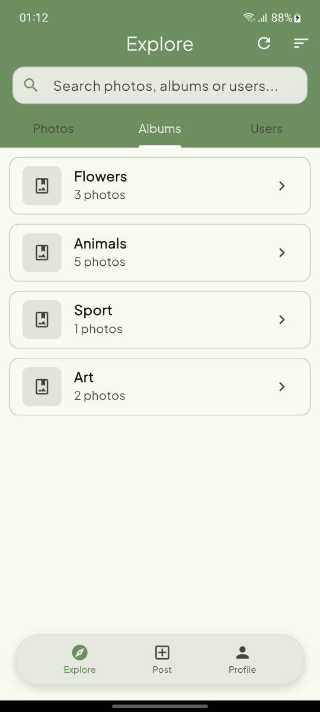
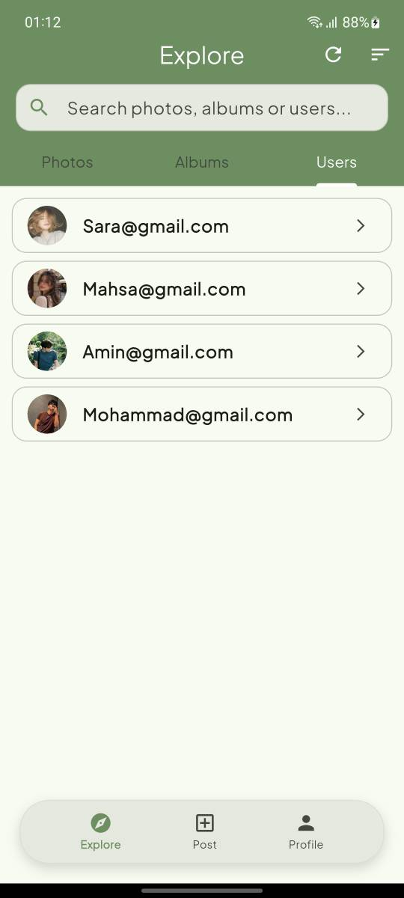
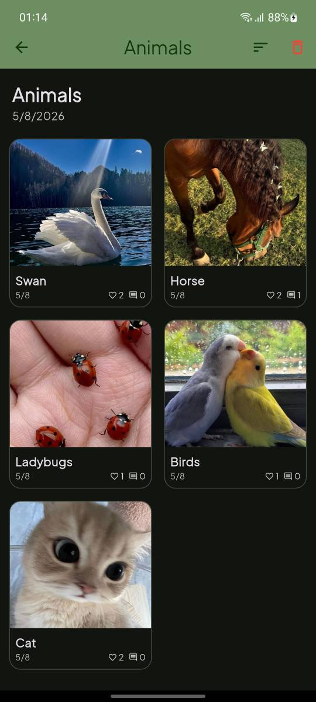
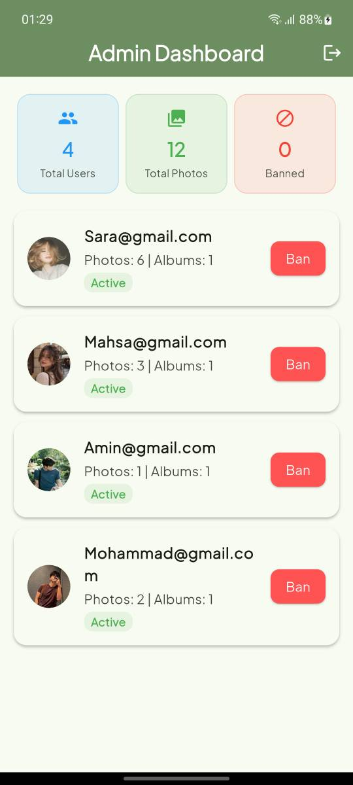

# MORA — PhotoShare

## Short Project Description

MORA is a photo-sharing application developed as an Advanced Programming project. The system combines a Flutter-based mobile client with a Java backend and uses a custom TCP socket protocol with JSON payloads for communication between the client and server.

The project focuses on user authentication, image upload and management, album organization, social interaction through likes and comments, theme personalization, and administrative user control.

## Overview

MORA provides a simple photo management platform in which users can sign up, log in, upload images, browse the photo feed, explore other users and albums, and manage their personal profile. The backend is implemented in Java and runs a persistent socket server that accepts multiple client connections asynchronously through separate threads.

The frontend is implemented in Flutter and Dart. It communicates with the Java server directly over TCP instead of using a REST framework or a generated API layer. Images are stored as files on the server, while user and photo metadata are persisted in a JSON database.

## Key Features

### Authentication and User Management

- User sign-up with either a Gmail address or mobile number format.
- User login and logout.
- Account deletion.
- Profile view and profile update.
- Avatar upload using a camera or gallery image source.
- Theme settings with light/dark mode and color customization.
- Admin login support and user ban/unban actions.

### Photo Management

- Photo upload from the device gallery or camera.
- Photo name, caption, and tag support.
- Optional comment enable/disable per photo.
- Photo likes and comments.
- Photo deletion and update.
- Photo search by name or tag.
- Image download and sharing support in the client.

### Explore and Discovery

- Home feed and user photo exploration.
- User profile browsing.
- Search by photo name and tag.
- Sorting capabilities for photo collections.
- User directory and album listing.

### Albums

- Album creation.
- Adding and removing photos from albums.
- Viewing album details and stored photos.
- User-specific album browsing.

### Administration

- Admin dashboard listing registered users.
- Ban and unban user actions.
- User statistics such as photo and album counts.

## Technology Stack

- Flutter
- Dart
- Java 17
- TCP Socket programming
- JSON-based request/response communication
- Gson library for Java JSON serialization
- Flutter plugins for image picking, sharing, and local storage
- Java file-based persistence for the application data and uploaded images

## Screenshots

The repository includes a set of screenshots in the folder named scrennshots. These images reflect the implemented screens and are used here as documentation for the current project state.

### Authentication

<p align="center">
  
  
</p>

### Profile and Account Management

<p align="center">
  
  
</p>

### Photo Management and Editing

<p align="center">
  
  
</p>

### Explore and Discovery

<p align="center">
  
  
  
</p>

### Albums

<p align="center">
  
</p>

### Administration

<p align="center">
  
</p>

## Backend Architecture

The backend is implemented in Java and centered around a direct socket server.

- The server starts in `server.BackendServer` and listens for client connections on port 8888.
- Every accepted connection is handled by a dedicated thread created from `server.ClientHandler`.
- Each client request is read as a JSON object containing an action name and a payload.
- The request is routed to the corresponding controller based on the `action` string.
- The server performs the required database and file operations and returns a JSON response.

The project does not use a REST framework. Instead, the system implements a custom message-based protocol over TCP sockets.

The server side is conceptually organized as follows:

```text
Flutter Client
      |
      | JSON over TCP Socket
      v
Java Socket Server
      |
      +----------------------+
      |                      |
      v                      v
User / Photo / Album     File Storage
Controllers              photos/ and uploads/
      |
      v
JSON database
backend/database/database.json
```

The backend includes multi-client handling because each new client connection is launched in its own thread, enabling concurrent processing.

## Client–Server Communication

The client and server communicate through a custom TCP socket protocol. The Flutter client establishes a socket connection to the Java server and sends a JSON request object of the following pattern:

```json
{
  "action": "login",
  "payload": {
    "username": "example@gmail.com",
    "password": "Example123"
  }
}
```

The server receives the message, dispatches it to the appropriate controller, and responds with a JSON payload containing `statusCode`, `message`, and `data` fields.

This design is implemented in the frontend service layer and the Java server route handler. The application uses direct socket communication rather than HTTP REST endpoints.

## Data Persistence and File Server

The project stores application state in a JSON-based database managed by `DatabaseManager`. The primary file is:

- backend/database/database.json

This file stores user records, photo metadata, albums, and comment records.

Uploaded image files are stored on disk in the backend file system:

- backend/photos/
- backend/uploads/avatars/

The file handling is performed by the backend server and by the file-related logic in the Java classes. Photo contents are saved as files and referenced by route paths, while metadata remains in the JSON database.

## Requirements

To run this project, the following tools are required:

- Flutter SDK
- Dart SDK
- Java JDK 17 or newer
- Android Studio or VS Code
- Android emulator or an Android device

## Getting Started

### 1. Clone the repository

```bash
git clone <repository-url>
cd Mora
```

### 2. Start the Java backend

Open the backend module in an IDE and run the class `server.BackendServer`.

You can also compile the Java project with Maven:

```bash
cd backend
mvn clean compile
```

### 3. Configure the Flutter client

The socket endpoint is currently set in the frontend client:

- frontend/lib/services/SocketService.dart

Update the server IP if your Java backend is running on a different machine or local network address.

### 4. Install Flutter dependencies

```bash
cd frontend
flutter pub get
```

### 5. Run the application

```bash
flutter run
```

## Project Structure

```text
Mora/
├── backend/
│   ├── database/
│   │   └── database.json
│   ├── photos/
│   ├── src/
│   │   ├── main/
│   │   │   └── java/
│   │   └── test/
│   ├── uploads/
│   │   └── avatars/
│   ├── pom.xml
│   └── target/
├── frontend/
│   ├── android/
│   ├── assets/
│   ├── ios/
│   ├── lib/
│   ├── test/
│   ├── analysis_options.yaml
│   ├── pubspec.yaml
│   └── README.md
├── scrennshots/
│   ├── adminpanel.jpg
│   ├── albums.jpg
│   ├── edit_photo.jpg
│   ├── edit_profile.jpg
│   ├── explore_album.jpg
│   ├── explore_photos.jpg
│   ├── explore_users.jpg
│   ├── login.jpg
│   ├── posts.jpg
│   ├── profile.jpg
│   └── splash.jpg
├── .gitignore
├── Mora.iml
├── README.md
└── scrennshots/
```

## Project Objectives

This project was developed as part of the Advanced Programming course and addresses the following technical objectives:

- Object-oriented design in Java
- Client-server software architecture
- TCP socket programming
- JSON-based communication between client and server
- User and photo CRUD operations
- Data persistence through JSON storage
- File management for user-uploaded photos and avatars
- Concurrent server-side processing through multiple client threads
- Mobile application development with Flutter and Dart

## Credits

Instructor:
Dr. Sadegh Aliakbari

The project uses Java, Flutter, Dart, and Android/desktop mobile application tooling for the client and server layers.
